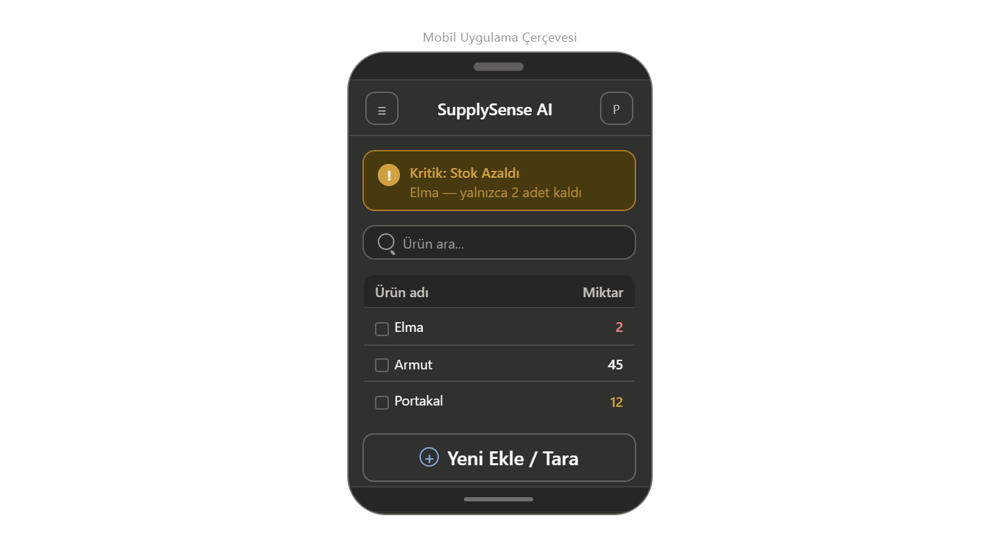
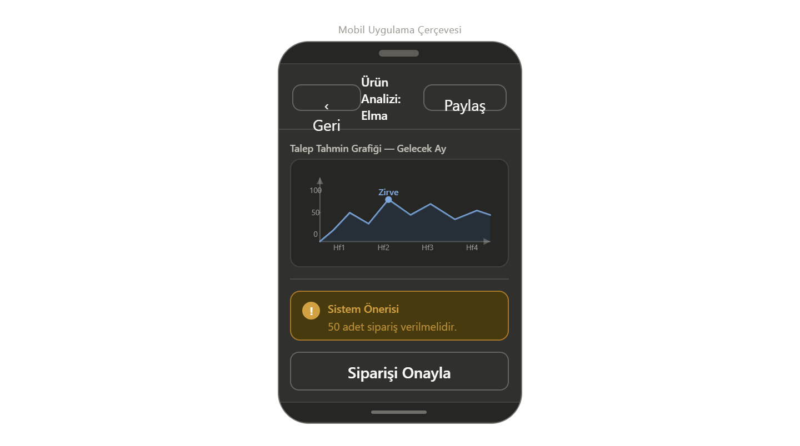

# LAB 4: Wireframe ve Ekran Akışı Planlaması

Bu doküman, SupplySense AI mobil uygulamasının düşük detaylı arayüz taslaklarını ve ekranlar arası geçiş mantığını içerir.

## 1. Ekran Taslakları (Wireframes)

### Ekran 1: Envanter Takip Paneli (Ana Ekran)

- **Amaç:** Stok listesini görüntüleme ve kritik uyarıları takip etme.
- **Bileşenler:** Arama çubuğu, Kritik stok uyarı paneli, Ürün listesi, Tarama butonu (FAB).

### Ekran 2: Görsel Tarama ve Veri Giriş Ekranı

- **Amaç:** Kamera ile otonom sayım yapma veya manuel veri girişi.
- **Bileşenler:** Kamera vizörü, Tarama butonu, Ürün adı/miktar form alanları, Kaydet butonu.

### Ekran 3: Öngörü ve Ürün Detay Ekranı

- **Amaç:** Yapay zeka tahminlerini ve grafiklerini inceleme.
- **Bileşenler:** Tahmin çizgi grafiği, Sipariş öneri kutusu, Onay ve Geri butonları.

## 2. Ekran Akış Şeması
Uygulama içi geçişler LAB 3 senaryoları ile tam uyumludur:
1. **Ana Ekran** -> (+) Butonu -> **Tarama Ekranı**
2. **Tarama Ekranı** -> Kaydet -> **Detay Ekranı**
3. **Ana Ekran** -> Ürün Seçimi -> **Detay Ekranı**

---
*Not: Bu taslaklar PlantUML kullanılarak fonksiyonel öncelikli hazırlanmıştır.*
